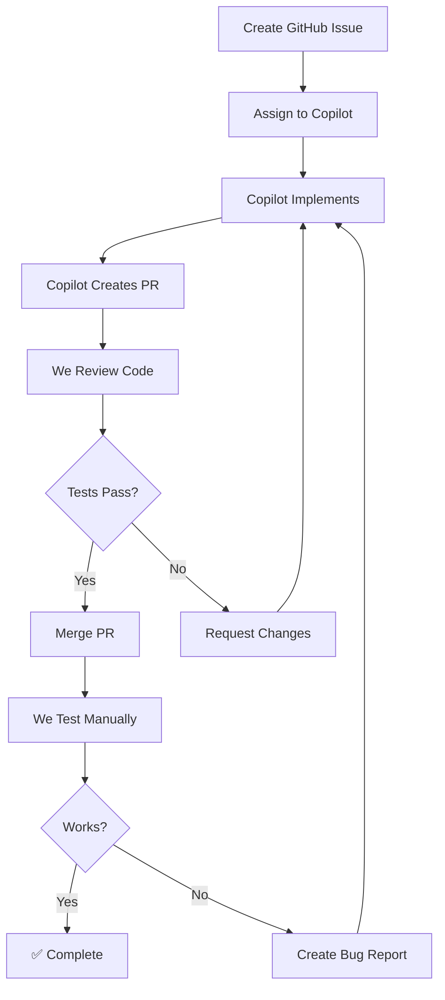

# 🤖 GitHub Copilot Tasks - Trading Bot Enhancement

**Created**: November 9, 2025  
**Updated**: November 9, 2025 (Added Issues #25-27)  
**Strategy**: Delegate complex tasks to GitHub Copilot, we focus on testing and validation

---

## 📋 Task Overview

We've created **7 comprehensive GitHub Issues** and assigned them to GitHub Copilot agent. Each issue includes:
- ✅ Detailed requirements and specifications
- ✅ Code examples and templates
- ✅ Acceptance criteria
- ✅ Expected deliverables

---

## 🎯 Phase 1: Strategy & Testing (Issues #17-20)

### Issue #17: 📊 Backtest on 2025 Historical Data
**Status**: 🤖 Assigned to Copilot  
**URL**: https://github.com/AgeeKey/yun_min/issues/17  
**Priority**: 🔴 Critical  
**Complexity**: 🟡 Medium  
**Estimated Time**: 2-4 hours

**Scope**:
- Download BTC/USDT 5m data (Jan-Nov 2025)
- Run backtest using existing `AdvancedBacktester`
- Calculate 8 performance metrics (win rate, Sharpe, drawdown, etc.)
- Generate results JSON and report

**Deliverables**:
- `run_backtest_2025.py` - Backtest script
- `backtest_results_2025.json` - Results data
- `data/historical/btc_usdt_5m_2025.csv` - Historical data

**Success Criteria**:
- Win rate > 45%
- Max drawdown < 20%
- All metrics calculated

---

### Issue #18: 🎯 Optimize RSI and EMA Parameters
**Status**: 🤖 Assigned to Copilot  
**URL**: https://github.com/AgeeKey/yun_min/issues/18  
**Priority**: 🔴 Critical  
**Complexity**: 🟡 Medium  
**Estimated Time**: 2-3 hours

**Scope**:
- Test 256 combinations (RSI buy: 4, RSI sell: 4, EMA fast: 4, EMA slow: 4)
- Grid search optimizing for Sharpe ratio
- Generate heatmap visualization
- Export best parameters

**Deliverables**:
- `optimize_parameters.py` - Optimization script
- `optimization_results.json` - All results
- `heatmap.png` - Visualization
- `OPTIMIZATION_REPORT.md` - Analysis

**Success Criteria**:
- Test all 256 combinations
- Find params with Sharpe > 2.0
- Heatmap generated

---

### Issue #19: 🧪 Live Testing (100+ iterations)
**Status**: 🤖 Assigned to Copilot  
**URL**: https://github.com/AgeeKey/yun_min/issues/19  
**Priority**: 🔴 Critical  
**Complexity**: 🔴 High  
**Estimated Time**: 4-6 hours (setup) + 24-48 hours (execution)

**Scope**:
- Run 200 iterations across 3 sessions
  - Normal market: 100 iterations
  - Volatile market: 50 iterations
  - Overnight: 50 iterations
- Monitor performance, costs, errors
- Generate comprehensive report

**Deliverables**:
- `run_live_test.py` - Test orchestrator
- `live_test_monitor.py` - Real-time dashboard
- `live_test_results_{session}.json` - Results
- `LIVE_TEST_REPORT.md` - Summary

**Success Criteria**:
- Complete 200 iterations
- Win rate > 50%
- No critical errors
- API cost < $15

**Duration**: 24-48 hours

---

### Issue #20: 🪙 Multi-Symbol Support (BTC/ETH/BNB)
**Status**: 🤖 Assigned to Copilot  
**URL**: https://github.com/AgeeKey/yun_min/issues/20  
**Priority**: 🟡 Important  
**Complexity**: 🔴 High  
**Estimated Time**: 4-6 hours

**Scope**:
- Add ETH/USDT and BNB/USDT trading
- Portfolio allocation: BTC 40%, ETH 35%, BNB 25%
- Correlation analysis (avoid over-concentration)
- Enhanced risk management

**Deliverables**:
- `run_multi_symbol_bot.py` - Multi-symbol bot
- Enhanced `portfolio_manager.py`
- `correlation_analyzer.py` - Correlation matrix
- `MULTI_SYMBOL_REPORT.md` - Results

**Success Criteria**:
- All 3 symbols trading independently
- Correlation < 0.9 (diversification)
- Better Sharpe than single-symbol

---

## 🎯 Phase 2: Monitoring & Infrastructure (Issues #25-27)

### Issue #25: 📊 Web Dashboard (TradingView Charts)
**Status**: 🤖 Assigned to Copilot  
**URL**: https://github.com/AgeeKey/yun_min/issues/25  
**Priority**: 🔴 Critical  
**Complexity**: 🟡 Medium  
**Estimated Time**: 6-8 hours

**Scope**:
- Build professional web dashboard with **TradingView Lightweight Charts**
- Same chart library as Binance uses
- Real-time WebSocket updates
- Mobile responsive design

**Features**:
- 📈 Professional candlestick chart (green/red candles)
- 📊 Volume bars, RSI, EMA indicators
- 💹 Live portfolio metrics
- 📜 Trade history with BUY/SELL markers
- 📉 Equity curve chart
- 📱 Mobile responsive

**Tech Stack**:
- TradingView Lightweight Charts (free, open-source)
- HTML + Vanilla JS (no build tools)
- Tailwind CSS (styling)
- FastAPI backend (already exists)

**Deliverables**:
- `yunmin/web/templates/index.html` - Main dashboard
- `yunmin/web/static/js/chart-tradingview.js` - Candlestick chart
- `yunmin/web/static/js/websocket-client.js` - WebSocket client
- `yunmin/web/static/js/dashboard.js` - Main logic
- `yunmin/web/static/css/dashboard.css` - Styling
- Enhanced `yunmin/web/api.py` - Static file serving

**Success Criteria**:
- Dashboard loads at http://localhost:8000
- Professional Binance-style charts display
- Real-time price updates via WebSocket
- Trade markers on chart (BUY/SELL arrows)
- No errors in browser console
- Mobile responsive (works on phone)

**Visual Impact**: 🌟 Very High (looks professional!)

---

### Issue #26: 📱 Telegram Bot Alerts
**Status**: 🤖 Assigned to Copilot  
**URL**: https://github.com/AgeeKey/yun_min/issues/26  
**Priority**: 🔴 Critical  
**Complexity**: 🟢 Easy  
**Estimated Time**: 2-3 hours

**Scope**:
- Set up Telegram bot for instant notifications
- Receive alerts on phone: trades, errors, drawdowns
- 3 alert levels: Critical, Trading, Daily summary

**Alert Categories**:
- 🔴 **Critical**: Bot crash, drawdown >10%, API errors
- 🟡 **Trading**: BUY/SELL executed, P&L updates
- 🟢 **Daily**: Performance summary (8am, 8pm)

**Deliverables**:
- `yunmin/notifications/__init__.py`
- `yunmin/notifications/telegram_bot.py` - Main bot class
- `setup_telegram.py` - Quick setup script (5 minutes)
- Integration with `yunmin/bot.py`
- Config updates (`config/default.yaml`)
- `tests/test_telegram.py` - Unit tests

**Success Criteria**:
- Test message sent successfully
- Trade alerts arrive within 1 second
- Critical alerts with sound notification
- Daily summaries automated
- Works even if bot crashes (async queue)
- Can disable via config

**Cost**: 💰 **Free** (Telegram API free forever)

**Quick Win**: Can set up in 30 minutes! 🚀

---

### Issue #27: ⚡ WebSocket Real-time Streaming
**Status**: 🤖 Assigned to Copilot  
**URL**: https://github.com/AgeeKey/yun_min/issues/27  
**Priority**: 🔴 Critical  
**Complexity**: 🟡 Medium  
**Estimated Time**: 3-4 hours

**Scope**:
- Replace 5-minute REST API polling with WebSocket streaming
- Real-time price updates (1 second vs 5 minutes)
- Connect to Binance WebSocket API
- Unlimited streaming (no rate limits)

**Binance WebSocket**:
- URL: `wss://stream.binance.com:9443/ws`
- Streams: kline, trade, ticker, depth
- Free (no API key needed)
- No rate limits (unlimited)

**Features**:
- Real-time candlestick updates
- Instant price ticks (every second)
- Live stop-loss monitoring
- Auto-reconnect on disconnect
- Multi-symbol support

**Deliverables**:
- Enhanced `yunmin/core/websocket_layer.py` - WebSocket client
- Integration with `yunmin/bot.py`
- Remove old REST polling code
- `examples/websocket_demo.py` - Usage example
- `tests/test_websocket.py` - Unit tests

**Success Criteria**:
- WebSocket connects to Binance
- Price updates within 1 second
- Stop-losses execute instantly
- Auto-reconnects if connection drops
- No API rate limit errors
- Old REST polling removed

**Performance**: 🚀 **300x faster!**

| Metric | REST API (Old) | WebSocket (New) |
|--------|----------------|-----------------|
| Update Frequency | Every 5 minutes | Every 1 second |
| Latency | ~300 seconds | ~50 milliseconds |
| API Calls | 120/minute | 0 (streaming) |
| Rate Limits | 1200/minute | Unlimited |
| Stop-Loss Speed | 5 min delay | <1 sec instant |

---

## 📊 Workflow



**Our Role**:
1. 📝 Create detailed issues with requirements
2. 👀 Review Copilot's pull requests
3. 🧪 Test implementations manually
4. ✅ Approve and merge when ready
5. 🐛 Report bugs if found

**Copilot's Role**:
1. 💻 Implement features from issues
2. 📄 Write clean, documented code
3. 🧪 Add unit tests
4. 📊 Create pull requests
5. 🔄 Fix bugs based on feedback

---

## ⏰ Timeline

### Week 1 (Nov 9-15):
- **Phase 1**: Strategy & Testing (Issues #17-20)
  - Day 1-2: Backtest + Optimization
  - Day 3-7: Live testing (24-48 hour run)
  - Day 5-7: Multi-symbol implementation

### Week 2 (Nov 16-22):
- **Phase 2**: Monitoring & Infrastructure (Issues #25-27)
  - Day 1-2: Web Dashboard (TradingView charts)
  - Day 3: Telegram Bot (quick win!)
  - Day 4-5: WebSocket streaming
  - Day 6-7: Testing and polish

### Week 3 (Nov 23-29):
- **Integration & Testing**
  - Integrate all improvements
  - End-to-end testing
  - Performance validation
  - Production deployment prep

---

## 📈 Success Metrics

### Phase 1 Completion:
- ✅ Backtest on 2025 data complete
- ✅ Optimal parameters found (Sharpe > 2.0)
- ✅ 200 live test iterations complete
- ✅ Multi-symbol trading working

### Phase 2 Completion:
- ✅ Professional web dashboard live
- ✅ Telegram alerts working on phone
- ✅ Real-time WebSocket streaming (1-sec updates)
- ✅ All features integrated

### Overall Success:
- **Performance**: Win rate >50%, Sharpe >1.5
- **Monitoring**: Dashboard + Telegram alerts
- **Speed**: Real-time data (1 sec vs 5 min)
- **Scalability**: Multi-symbol support
- **Reliability**: Auto-reconnect, error handling
- **Cost**: <$15/month

---

## 🚀 Quick Wins (While Waiting for Copilot)

While Copilot works on the issues, we can do quick 30-minute tasks:

### 1. Set Up Telegram Bot (30 min)
```bash
python setup_telegram.py
# Follow prompts, add to config
# Test: python -c "from yunmin.notifications.telegram_bot import get_telegram_bot; ..."
```

### 2. Test Existing Web API (15 min)
```bash
cd yunmin/web
uvicorn api:app --reload --port 8000
# Open: http://localhost:8000/docs
# Test API endpoints
```

### 3. Test WebSocket Connection (30 min)
```python
# Quick test script
import asyncio
import websockets

async def test():
    uri = "wss://stream.binance.com:9443/ws/btcusdt@trade"
    async with websockets.connect(uri) as ws:
        for i in range(10):
            msg = await ws.recv()
            print(msg)

asyncio.run(test())
```

---

## 📝 Notes

- **Communication**: Copilot will create PRs, we'll get notifications
- **Testing**: Always test manually after merging
- **Feedback**: If bugs found, create new issue or comment on PR
- **Flexibility**: Can adjust requirements in issue comments
- **Priorities**: Phase 1 (testing) before Phase 2 (monitoring)

---

## ✅ Completion Checklist

### Phase 1:
- [ ] Issue #17 - Backtest 2025 data
- [ ] Issue #18 - Parameter optimization
- [ ] Issue #19 - Live testing (200 iterations)
- [ ] Issue #20 - Multi-symbol support

### Phase 2:
- [ ] Issue #25 - Web Dashboard (TradingView charts)
- [ ] Issue #26 - Telegram Bot alerts
- [ ] Issue #27 - WebSocket streaming

### Integration:
- [ ] All features working together
- [ ] Dashboard shows real-time data
- [ ] Telegram alerts on trades
- [ ] Multi-symbol trading live
- [ ] Production ready

---

**Next Steps**: Wait for Copilot to create PRs, then review and test! 🚀
